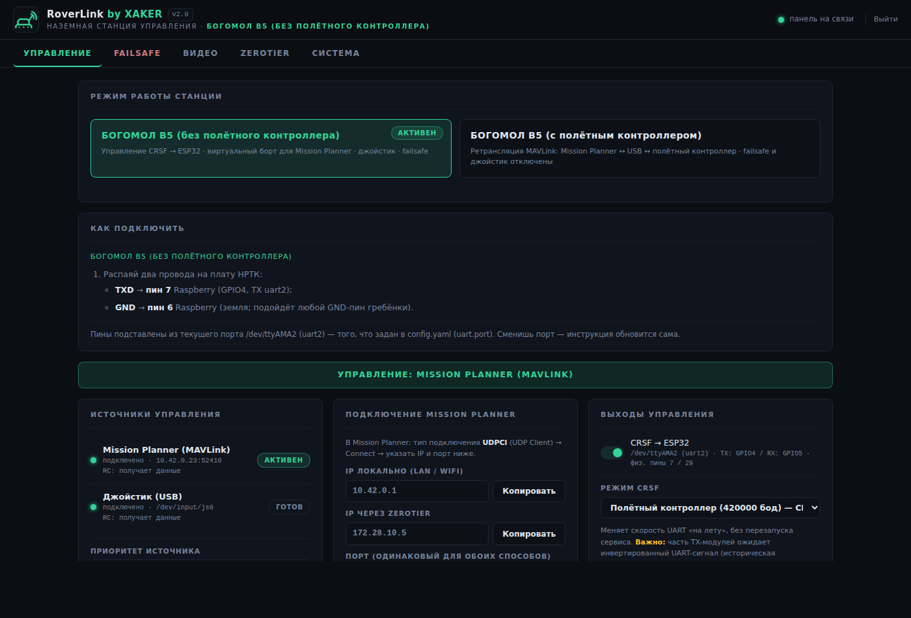
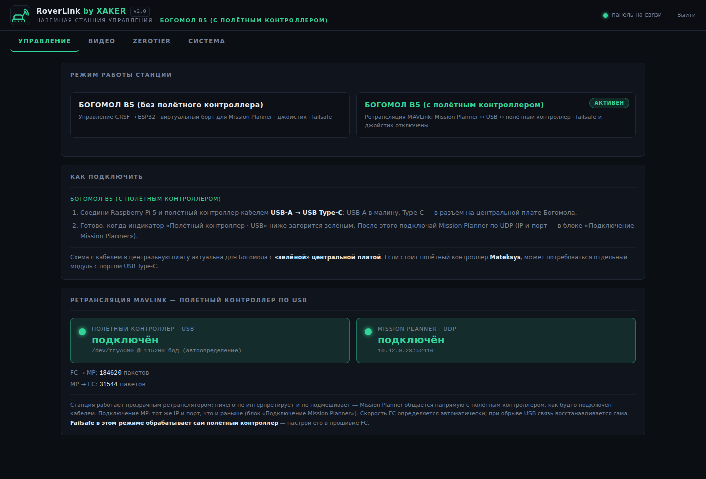
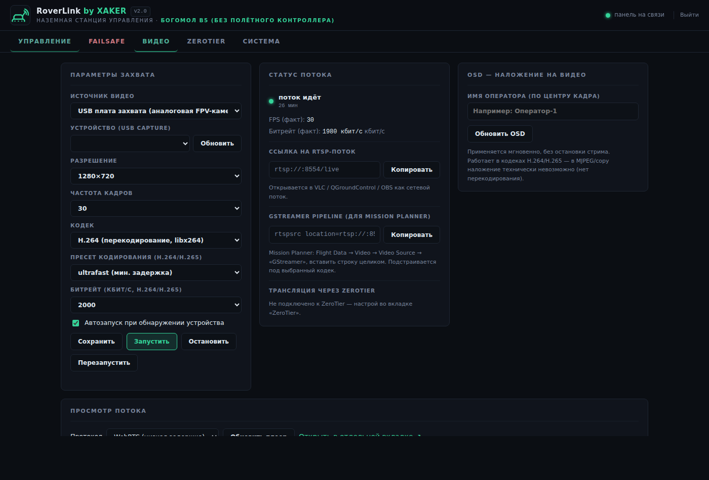
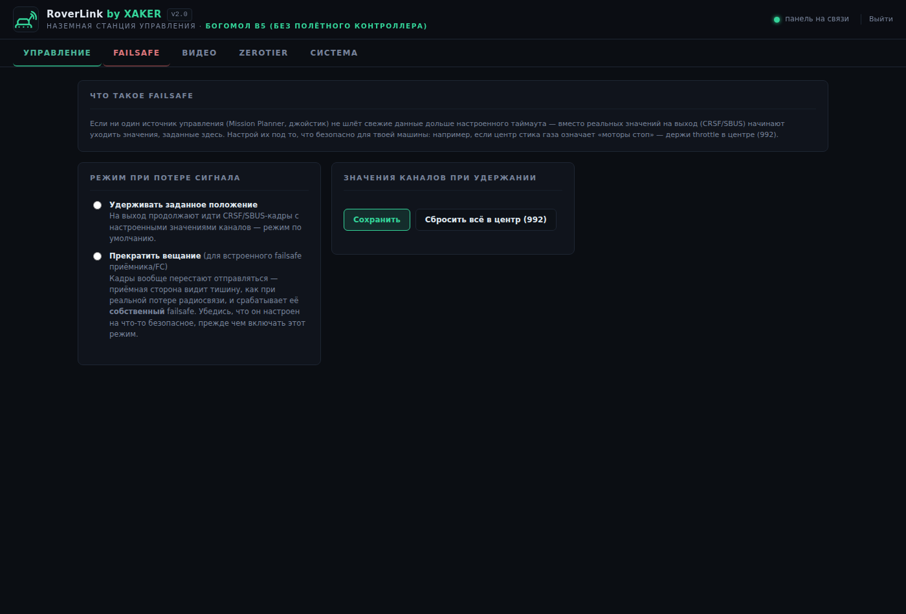
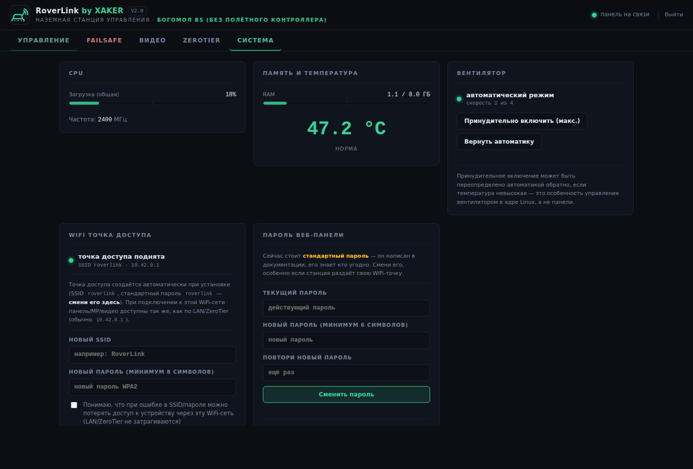
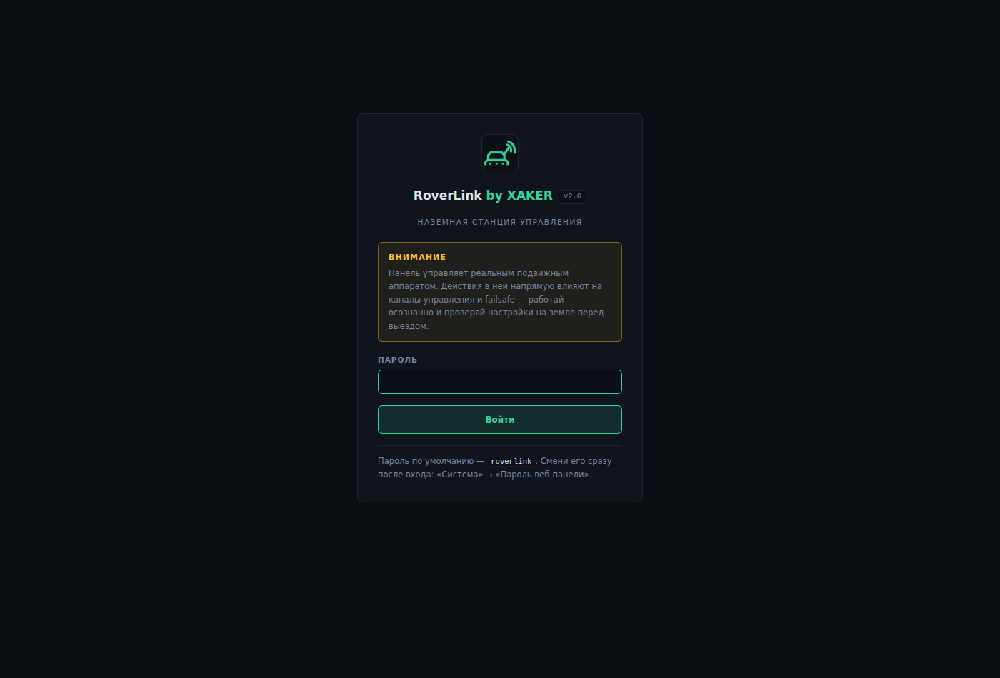

# RoverLink


**Наземная станция управления беспилотной машиной на Raspberry Pi 5.
Два режима: виртуальный борт (Mission Planner / USB-джойстик → MAVLink →
CRSF/SBUS → ESP32) и прозрачный ретранслятор MAVLink на полётный контроллер
по USB. Плюс FPV-видео по RTSP и веб-панель управления.**

Автор: **XAKER** · Версия: **2.0** · Лицензия: **GPL-3.0** — форки и
доработки обязаны оставаться открытыми.

> **До версии 2.0 проект назывался GroundBridge.** Сменилось только имя:
> автор, лицензия и история разработки те же, версии 1.1–1.9 выходили под
> прежним названием. Переезд с прежней установки описан в
> [docs/install.md](docs/install.md).



```
                       ┌────────────────────── Raspberry Pi 5 ──────────────────────┐
 Mission Planner ──UDP─►  MAVLink-источник ─┐                                       │
 (через LAN / ZeroTier)│                    ├─► арбитраж ─► CRSF ──UART─► ESP32     │
 USB-джойстик ─────────►  Joystick-источник ┘   каналов  └► SBUS ──UART─► второй FC │
                       │                                                            │
 FPV-приёмник ──USB────►  ffmpeg ─► MediaMTX ──RTSP/WebRTC/HLS─► VLC / MP / браузер │
 (плата захвата)       │                                                            │
                       │  Веб-панель (Flask + WebSocket) — управление всем          │
                       └────────────────────────────────────────────────────────────┘
```

## Возможности

- **Два режима станции** (переключаются из панели, названия настраиваются):
  *виртуальный борт CRSF* — для машин с ESP32, и *прозрачный ретранслятор
  MAVLink по USB* — для машин с полноценным полётным контроллером (F405
  и т.п.): автоопределение скорости FC, авто-адрес Mission Planner,
  автопереподключение при обрыве USB. См. [docs/modes.md](docs/modes.md).

- **Два источника управления с арбитражем**: Mission Planner по сети
  (MAVLink `RC_CHANNELS_OVERRIDE`, джойстик-оверрайд) и USB-джойстик,
  подключённый прямо к Pi (например, пульт в режиме USB Joystick). Приоритет
  переключается на лету из панели; при пропадании основного источника
  управление мгновенно подхватывает резервный.
- **Два выхода одновременно**: CRSF (420000/400000 бод — приёмник FC или
  TX-модуль в радио-бэе) и SBUS (второй полётный контроллер), каждый на своём
  UART, включаются/выключаются независимо без перезапуска сервиса.
- **Настраиваемый failsafe**: удержание заданных значений каналов или полное
  прекращение вещания (для срабатывания встроенного failsafe приёмника).
  Настраивается из панели, переживает перезапуск.
- **FPV-видео**: USB-плата захвата или внешняя RTSP-камера → MediaMTX →
  RTSP/WebRTC/HLS. Встроенный плеер в панели, готовый GStreamer-pipeline для
  Mission Planner, OSD с именем оператора «на лету», автозапуск при
  обнаружении устройства и тестовая заглушка, когда камеры нет.
- **Удалённый доступ через ZeroTier**: подключение к сети, авто-авторизация
  ноды по Central API-токену, статус и готовые ссылки — из панели.
- **WiFi-точка доступа из коробки** (SSID/пароль по умолчанию —
  `roverlink`/`roverlink`): поднимается автоматически при
  установке (регион WiFi и rfkill настраиваются сами) — Pi раздаёт
  собственную сеть для работы «в поле», панель полностью офлайн (никаких CDN).
- **Веб-панель на русском**: тёмная тема, живые значения каналов по
  WebSocket, мониторинг CPU/RAM/температуры/вентилятора.
- **Вход по паролю всегда включён**: пароль из коробки — `roverlink`,
  меняется прямо из панели («Система» → «Пароль веб-панели») и хранится
  локально на устройстве, переживая обновления проекта.
- **Клонирование на несколько устройств**: упаковка дампа и «де-клонирование»
  (сброс ZeroTier ID, SSH-ключей, machine-id) одной кнопкой из панели.

## Скриншоты

| Режим с полётным контроллером | Видео |
|---|---|
|  |  |

| Failsafe | Система |
|---|---|
|  |  |

| Вход в панель | |
|---|---|
|  | |

## Железо

| Компонент | Назначение |
|---|---|
| Raspberry Pi 5 | мозг станции; нужны 1–2 свободных UART (dtoverlay) |
| ESP32 на машине | приём CRSF по UART (3.3V, общий GND) |
| USB-плата захвата (UVC) | оцифровка аналогового FPV-видео |
| USB-джойстик / пульт в режиме USB Joystick | резервное прямое управление |
| Опционально: второй FC с SBUS-входом | параллельный выход SBUS |

## Доступ к проекту

RoverLink развивается по двухветочной модели (см.
[docs/licensing.md](docs/licensing.md)):

- **Свободное ядро (OSS, GPL-3.0)** — базовая версия станции.
- **Коммерческая ветка** — расширенный функционал с активацией по ключам
  на каждое устройство.

Эта страница — витрина проекта: здесь документация, скриншоты и условия
лицензирования, исходный код в этом репозитории не публикуется. По вопросам
доступа, ключей активации и условий использования свяжитесь с автором.


## Документация

| Раздел | Описание |
|---|---|
| [docs/install.md](docs/install.md) | установка, UART, джойстик, systemd |
| [docs/modes.md](docs/modes.md) | режимы станции: CRSF-борт и ретранслятор MAVLink по USB |
| [docs/licensing.md](docs/licensing.md) | модель лицензирования: OSS-ядро + коммерческая ветка с активацией |
| [docs/mission-planner.md](docs/mission-planner.md) | подключение Mission Planner по сети |
| [docs/failsafe.md](docs/failsafe.md) | поведение при потере сигнала — прочти до первого выезда |
| [docs/video.md](docs/video.md) | видео: захват, RTSP, плеер, OSD, GStreamer |
| [docs/zerotier.md](docs/zerotier.md) | удалённый доступ через ZeroTier |
| [docs/sbus.md](docs/sbus.md) | второй выход SBUS и режимы CRSF |
| [docs/wifi-ap.md](docs/wifi-ap.md) | WiFi-точка доступа, работа в поле |
| [docs/security.md](docs/security.md) | пароль панели, модель sudoers-хелперов |
| [docs/cloning.md](docs/cloning.md) | клонирование на несколько устройств |

## ⚠ Безопасность

Это ПО управляет реальной машиной. Перед первым выездом:

1. Проверь **на земле** реакцию каждого канала на полный диапазон стика.
2. Настрой **failsafe** (вкладка Failsafe в панели) под логику своей машины
   и проверь его, физически оборвав связь.
3. **Смени пароль панели.** Вход защищён паролем всегда, но из коробки он
   стандартный — `roverlink`, и его знает каждый, кто читал этот файл.
   Меняется прямо из панели: «Система» → «Пароль веб-панели».

Автор не несёт ответственности за ущерб, причинённый использованием этого ПО
(см. разделы 15–16 лицензии GPL-3.0).

## Структура проекта

```
roverlink/
├── run.py                  # точка входа
├── VERSION                 # версия ПО — её показывает панель в шапке
├── config.example.yaml     # шаблон конфигурации (рабочий config.yaml — в .gitignore)
├── install.sh              # автоустановка на чистую Raspberry Pi OS
├── bridge/                 # ядро
│   ├── version.py           # чтение файла VERSION
│   ├── state.py             # общее состояние + арбитраж источников
│   ├── sources/             # mavlink (Mission Planner) и joystick (pygame)
│   ├── crsf/, sbus/, common/ # протоколы: упаковка кадров, CRC, 11-бит каналы
│   ├── failsafe/            # значения каналов + режим hold/mute
│   ├── video/               # ffmpeg → MediaMTX, автозапуск, заглушка
│   ├── zerotier/            # join/leave/статус/авто-авторизация
│   ├── system_monitor/      # CPU/RAM/температура/вентилятор
│   ├── wifi_ap/             # статус и смена SSID/пароля точки доступа
│   └── declone/             # «де-клонирование» SD-карты
├── webapp/                 # Flask + SocketIO, панель (static/css, static/js)
├── scripts/                # root-хелперы, деплой, дамп, смена пароля
├── systemd/                # unit-файл сервиса
└── data/                   # runtime-файлы (в .gitignore)
```

## Вклад в проект

Issues и pull request'ы приветствуются. Проект под GPL-3.0: отправляя PR, ты
соглашаешься лицензировать свой вклад на тех же условиях.

## Лицензия

GPL-3.0 — см. [LICENSE](LICENSE). Используя, модифицируя и распространяя
этот проект, ты соглашаешься сохранять производные работы открытыми под той
же лицензией.
