<div align="center">


</div>

```
┌──────────────────────────────────────────────────────────────┐
│  > project                                                   │
│  RoverLink — Ground Control Station for UGV                  │
│  > mission                                                   │
│  Богомол B5 · Антилопа 4×4 — два НРТК, одна станция          │
│  > platforms                                                 │
│  Raspberry Pi 5 · Raspberry Pi 4 · Radxa ROCK 5C             │
│  > status                                                    │
│  ● v2.5-beta8 — BETA — LINK SECURE                             │
└──────────────────────────────────────────────────────────────┘
```

<div align="center">

[](LICENSE)


</div>

**Наземная станция управления беспилотной машиной.** Одноплатный компьютер
между оператором и машиной: принимает управление из Mission Planner по сети
и отдаёт его на борт по CRSF, работает прозрачным мостом к полётному
контроллеру по USB — или говорит с машиной её собственным протоколом, если
он у неё свой. Плюс FPV-видео по RTSP и веб-панель, из которой настраивается
всё остальное.

Поддержаны два НРТК: **Богомол B5** и **Антилопа** (4×4 мотор-колёса).

> ⚠️ **Владельцам «Антилопы»: станции старше 2.5-beta7 управляют машиной
> неверно.** Машина почти не поворачивает на малом газу, не тормозит
> рекуперацией на заднем ходу и в развороте. Причины найдены на живом железе
> и исправлены — [подробности и что именно проверить](docs/machines.md#антилопа).
> Обновите станцию до выезда.

Автор: **Dmitry Prokofev (XAKER)** · Лицензия: **GPL-3.0**


```
                       ┌──────── Pi 5 / Pi 4 / Radxa ROCK 5C ─────────────────┐
 Mission Planner ──UDP─►  MAVLink ─┬─► CRSF ──UART─► ESP32 машины             │
 (LAN / WiFi / ZeroTier)│          └─► SBUS ──UART─► второй полётный контроллер│
                        │                                                      │
 FPV-приёмник ──USB────►  ffmpeg ─► MediaMTX ─► RTSP / WebRTC / HLS            │
                        │                                                      │
                        │  Веб-панель (Flask + WebSocket) — управление всем     │
                        └──────────────────────────────────────────────────────┘
```

## `▌ SPEC // КОРОТКО`

| | |
|---|---|
| **Железо** | Raspberry Pi 5, Raspberry Pi 4 или Radxa ROCK 5C — одна сборка на все три |
| **Управление** | Mission Planner по сети, `RC_CHANNELS_OVERRIDE` |
| **Выходы** | CRSF 420000/400000 бод и SBUS — одновременно, каждый на своём UART |
| **НРТК** | Богомол B5 · Антилопа (4×4 мотор-колёса) |
| **Режимы** | виртуальный борт для машин с ESP32 · прозрачный мост к полётному контроллеру · собственный протокол «Антилопы» |
| **Видео** | USB-плата захвата или IP-камера → RTSP/WebRTC/HLS, проброс без обработки, OSD |
| **Связь** | WiFi-точка доступа станции, LAN, меш AYAKS, ZeroTier |
| **Панель** | русский интерфейс, тёмная тема, работает офлайн, вход по паролю |

## `▌ MACHINES // МАШИНЫ`

Станция работает с двумя НРТК, и работает с ними по-разному: у одной есть
полётный контроллер и стандартный радиопротокол, у другой нет ни того, ни
другого. Поэтому режимы взаимно исключают друг друга — включённая «Антилопа»
останавливает CRSF, SBUS и ретрансляцию целиком.

Ниже по каждой машине: как она устроена, что вылезло на испытаниях и чем это
закрыто. Почти каждый пункт в разделах «что вылезло» — реальный выезд, а не
задумка за столом.

---

### `▌ БОГОМОЛ B5`

Машина с полётным контроллером или с ESP32 на приёме. Станция подаёт ей
каналы так же, как это делал бы приёмник радиоуправления.

Два способа подключения, и выбор между ними — это выбор, **кто отвечает за
failsafe**:

| Режим | Как соединяется | Кто держит failsafe |
|---|---|---|
| **Богомол B5 (без полётного контроллера)** | станция изображает борт для Mission Planner и отдаёт машине CRSF (420000 бод) или SBUS по UART | станция |
| **Богомол B5 (с полётным контроллером)** | станция — прозрачный мост MAVLink между Mission Planner и контроллером по USB | сам контроллер |


**Что вылезло на испытаниях**

| Проблема | Причина | Решение |
|---|---|---|
| Видео рвалось каждые десять секунд | наблюдатель опрашивал камеру во время трансляции и рвал сессию дешёвых RTSP-камер | опрос убран: живой поток сам по себе доказывает, что камера на месте |
| Статика «уезжала» на чужой сетевик | имена интерфейсов зависели от порядка включения USB-адаптера | правило udev: встроенная плата всегда `eth0`, USB-адаптер всегда `eth1` |
| Новый адрес отрезал станцию от панели | адрес применялся сразу и безвозвратно | смена адреса с обратным отсчётом и авто-откатом через полторы минуты |
| Установка не проходила на борту без интернета | установщик безусловно лез в сеть за пакетами | закрытый борт распознаётся, зависимости сверяются локально, скачивания честно пропускаются |


Подробности: [docs/modes.md](docs/modes.md) ·
[docs/network.md](docs/network.md) · [docs/failsafe.md](docs/failsafe.md)

---

### `▌ АНТИЛОПА 4×4`

> ⚠️ **Станции старше 2.5-beta7 управляют этой машиной неверно.** Обновите
> до выезда — что именно было не так, разобрано ниже.

Колёсная платформа 4×4 на мотор-колёсах, без руля: поворачивает разницей
мощностей бортов, то есть проскальзыванием колёс. Полётного контроллера у
неё нет вовсе, а плата управления исполняет всё, что ей пришлют.

Между штатным пультом и платой стоит не приёмник радиоуправления, а
радиоудлинитель UART (LoRa, 220–236 МГц). Протокола обмена нет ни в одной
документации на изделие. Сначала он был снят с эфира и разобран по
наблюдениям, а затем **сверен с исходниками прошивок** штатного пульта и
платы управления, которые передал разработчик машины. Станция ставится
**вместо радиомодуля** и говорит с платой напрямую тем же протоколом, с той
же частотой кадров — для платы это неотличимо от штатного пульта.

Мотор-колёса управляются четырьмя контроллерами Kelly KLS7212N: станция
задаёт мощность бортов и направление, торможение рекуперацией отрабатывают
сами контроллеры.

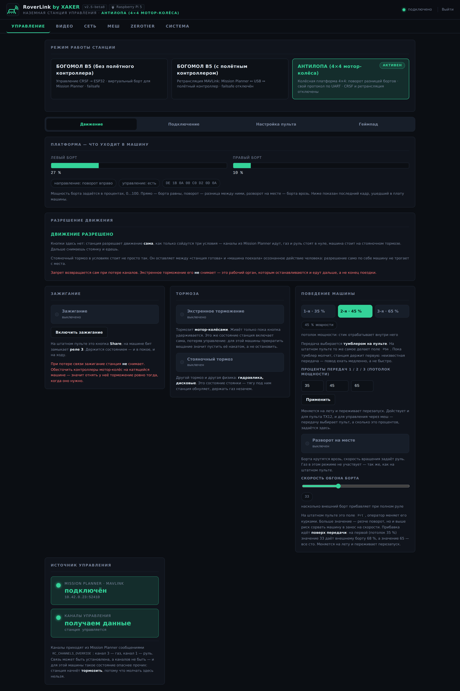

**Что вылезло на испытаниях**

| Проблема на машине | Причина | Решение |
|---|---|---|
| **Не поворачивала на малом газу.** Управляемо только на третьей передаче и полном газу | мы прижимали внешний борт к потолку передачи, а штатный пульт добавляет поворот **поверх** него: на первой передаче это 35 % против 68 % | закон подмешивания переписан дословно по прошивке пульта |
| **Разворот на месте не проворачивал машину** | мы ограничивали его передачей | в прошивке пульта эта ветка передачей не ограничена — сняли и мы |
| **Не тормозила рекуперацией на заднем ходу** | в кадрах остановки терялись биты направления: контроллерам приходило «еду вперёд плюс тормоз», когда машина катилась назад | направление берётся из памяти о последнем кадре с тягой и повторяется во всех кадрах остановки |
| **После разворота один борт уходил накатом** | маска разворота схлопывалась, как только руль возвращался в центр | то же правило: кадр без тяги наследует прежнее направление |
| **Экстренный тормоз качал гидравлику** при каждом нажатии | осознанный экстренный уходил тем же кадром, что и потеря связи, а тот всегда поднимает стояночный | ветки разведены: экстренный не трогает состояние стоянки |
| **Стояночный качает гидравлику восемь секунд** | штатное поведение железа: привод с ходом 4 секунды в каждую сторону | это не чинится и чинить нечего — просто так устроена машина |
| **Тормоза не было вовсе** | на машине оказалась не подключена фишка `STOP 1` — вход тормоза контроллеров | проверьте её перед выездом: при нажатом экстренном цепь должна замыкаться |

**Особенности, из-за которых режим устроен иначе остальных**

**Failsafe не может быть молчанием.** Для машины с четырьмя мотор-колёсами
прекращение вещания — это движение накатом, а не остановка. Потеряв
управление, станция продолжает слать кадры и давит оба тормоза: экстренный
держится, пока управление не вернётся, стояночный остаётся поднятым и после
того, как станция замолчит совсем.

**Свой арм, автоматический.** Станция разрешает движение сама, когда сойдутся
три условия: каналы идут, газ и руль в нуле, машина стоит на стояночном
тормозе. Кнопки в панели нет намеренно — между «станция готова» и «машина
поехала» остаётся осознанное действие человека: снять стоянку.

**Передачи.** Трёхпозиционный тумблер ограничивает мощность: 35 %, 45 %,
65 %, проценты правятся из панели на лету. Потолок ограничивает **ход
вперёд**, но не добавку на поворот — именно так устроен штатный пульт, и
именно в этом была причина неуправляемости на грунте.

**Два разных тормоза.** Экстренный тормозит мотор-колёсами рекуперацией и
живёт только пока его удерживают. Стояночный — гидравлика и дисковые
тормоза, работает как состояние.

**Зажигание.** Тумблер в панели, кнопка Create на геймпаде или канал пульта —
но не двое сразу: у бита в каждый момент ровно один хозяин.

**Раскладка под RadioMaster TX12 прямо в панели.** Какой канал за что
отвечает, какой орган пульта ему соответствует и что приходит по нему
**прямо сейчас**. Подвигал орган — увидел, какая строка ожила: единственный
способ поймать перепутанную ось, не выезжая.

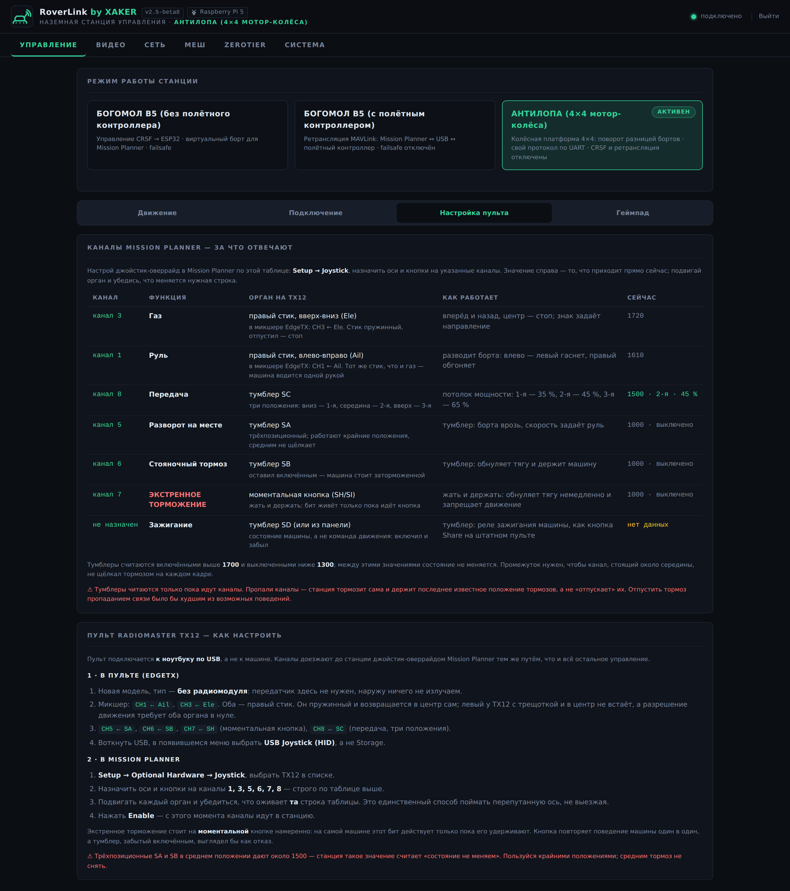

**Управление с геймпада — идти рядом с машиной пешком.** DualSense по
Bluetooth: пара переживает перезагрузку, пад цепляется кнопкой PS, поиск и
подключение — из панели. В основе **мёртвая рука**: движение разрешено
только пока удержан L2, отпустил — газ в ноль, экстренный мотор-тормоз и
стояночный; выронил пад — штатный failsafe. Раскладка выверена на стенде:
разворот на месте сидит на триггере R2, а не на кнопке, потому что кружок
физически не удержать одновременно с правым стиком.

| Орган | Функция |
|---|---|
| **L2** | мёртвая рука — без неё машина не поедет |
| левый стик | газ вперёд-назад |
| правый стик | руль |
| **R2** | разворот на месте |
| **R1** | стояночный тормоз (тумблер) |
| треугольник | экстренное торможение |
| **Create** | зажигание |

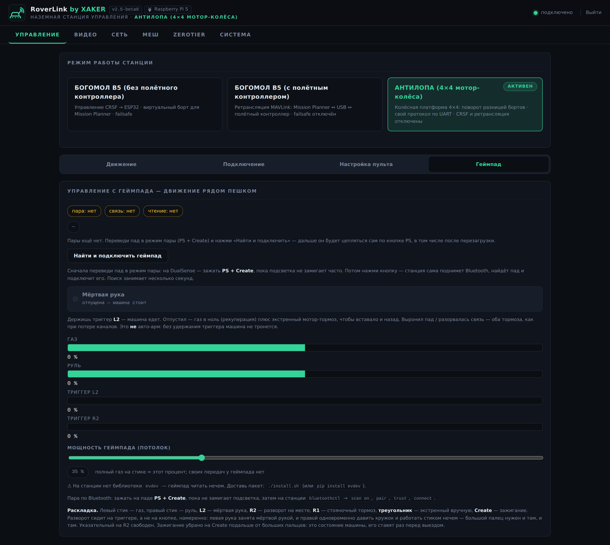

Подробности: [docs/machines.md](docs/machines.md) ·
[docs/robot-lora.md](docs/robot-lora.md) ·
[docs/gamepad.md](docs/gamepad.md)

---

## `▌ WHAT'S NEW // ЧТО НОВОГО В 2.5`

**Управление «Антилопой» переписано по исходникам производителя.** Разработчик
машины передал исходники обеих сторон — пульта и платы управления. Догадки,
снятые с эфира, заменены фактами: закон поворота, поведение тормозов,
назначение каждого бита. Все семь пунктов таблицы выше — из этой работы.

**Сеть настраивается из панели.** Отдельная вкладка: DHCP или статика на
каждый интерфейс, смена адресов на лету — с обратным отсчётом и авто-откатом.
Настройки переживают обновление станции: потерять адрес машины в поле нельзя.

**RTSP-камера идёт мимо станции.** Проброс без обработки: поток тянет сам
MediaMTX, плата в видеотракте не участвует. Разрешение, частота кадров и
кодек остаются камерными, задержек станция не добавляет.

**Веб-морда камеры — оператору.** Камера за вторым сетевиком живёт в своей
подсети, и ноутбук оператора до неё не достаёт. Станция перекидывает её
веб-порт на себя: `http://<станция>:8081`. Адрес берётся из ссылки RTSP —
работает с любой камерой без настройки.

**Меш и сканер подсетей.** Качество линка, соседи, шум и скорости меш-модема
рядом с телеметрией машины. Рядом — сканер подсетей: кто занимает адреса и
чем именно, а главное, **конфликт адресов** отдельным блоком. В меше все
устройства оказываются в одной подсети, и совпадение адреса рвёт связь без
видимой причины.

**Установка без интернета.** Установщик распознаёт закрытый борт: системные
пакеты сверяются локально, Python-зависимости — импортом. На машине без сети
установка проходит целиком.

## `▌ FEATURES // ВОЗМОЖНОСТИ`

**Одна сборка на три платы.** Плата определяется при старте: карта UART,
номера пинов в подсказках, способ включения оверлея, термозона и работа с
вентилятором подставляются сами. Провод распайки идёт на **один и тот же
физический пин на всех трёх платах** — переносишь машину с одной на другую,
паять заново не нужно. Скорость CRSF 420000 бод проверена на живом железе
каждой. См. [docs/boards.md](docs/boards.md).

**Два режима станции**, переключаются из панели. *Виртуальный борт* — для
машин с ESP32: станция сама изображает борт для Mission Planner и отдаёт
каналы по CRSF. *Прозрачный мост* — для машин с полноценным полётным
контроллером: автоопределение скорости FC, авто-адрес Mission Planner,
автопереподключение при обрыве USB. См. [docs/modes.md](docs/modes.md).

**Связь и каналы показаны раздельно.** «Mission Planner подключён» и
«машина управляется» — разные состояния, и путать их дорого. Если связь
есть, а каналов нет, станция держит failsafe и говорит об этом прямо.

**Настраиваемый failsafe**: удержание заданных значений каналов или полное
прекращение вещания, чтобы сработал собственный failsafe приёмника.
Настраивается из панели, переживает перезапуск.

**FPV-видео**: USB-плата захвата или внешняя RTSP-камера → MediaMTX →
RTSP/WebRTC/HLS. Для RTSP-камеры — **проброс без обработки**: станция вне
видеотракта, никакой задержки и нагрузки. Готовый GStreamer-pipeline для
Mission Planner, OSD с именем оператора на лету, автозапуск и заглушка при
пропаже камеры. См. [docs/video.md](docs/video.md).

**Сеть из панели.** Вкладка «Сеть»: DHCP или статика на каждый интерфейс,
смена на лету с авто-откатом, детерминированные имена плат (встроенная —
`eth0`, USB — `eth1`). Настройки переживают обновление станции.
См. [docs/network.md](docs/network.md).

**Работа в поле без инфраструктуры.** Станция поднимает свою WiFi-точку
доступа на `hostapd` со своим DHCP, панель полностью офлайн — никаких
внешних CDN. Удалённо — через ZeroTier, без пробросов портов.

**Эксплуатация.** Вход по паролю включён всегда, пароль меняется из панели
и переживает обновления. Мониторинг CPU, памяти, температуры и вентилятора.
Клонирование на несколько устройств с «де-клонированием» одной кнопкой.

## `▌ ONE BUILD // ОДНА СБОРКА, ТРИ ПЛАТЫ`

Один и тот же блок «Как подключить» на трёх разных платах. Номер UART и имя
устройства станция подставляет из профиля платы — а физический пин остаётся
тем же.

| |
|---|
| 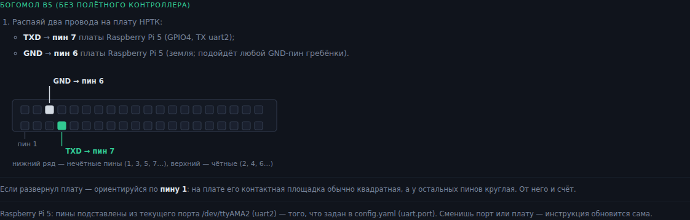 |
|  |
| 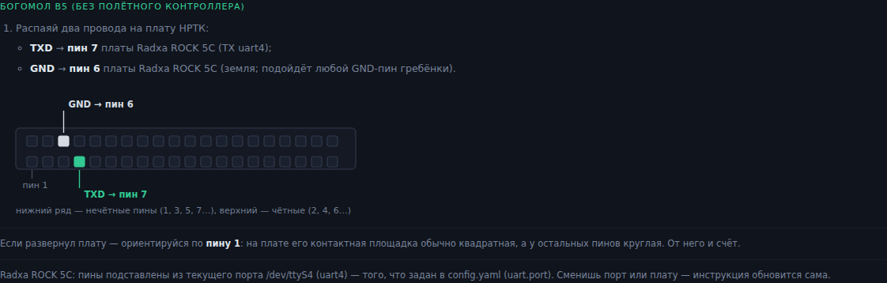 |

Плата подписана в шапке панели — чтобы не путать станции, когда их несколько:

| | | |
|---|---|---|
|  |  |  |

Вкладка «Система» на тех же трёх платах. Число ядер, объём памяти, источник
температуры и работа с вентилятором — из профиля платы, а не захардкожены:
у Pi 5 вентилятор есть и им можно управлять, у Pi 4 его просто нет, у
ROCK 5C он подключён, но при низкой температуре ядро держит его
остановленным — панель говорит именно это, а не «работает (0%)».

| |
|---|
| 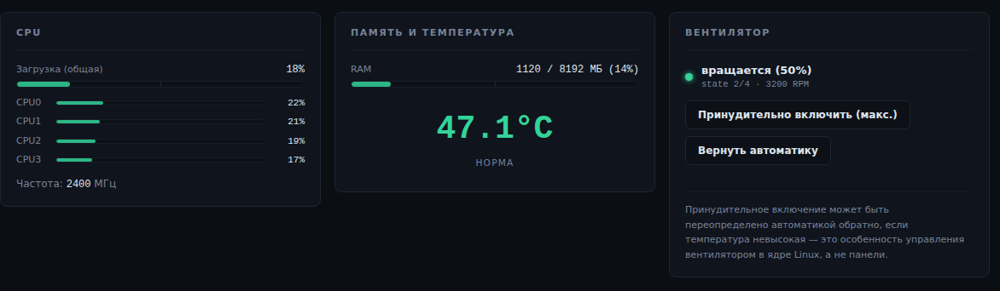 |
| 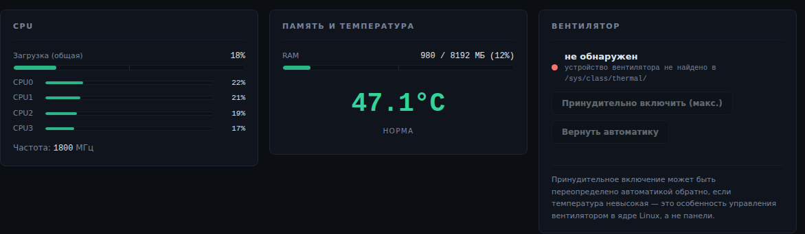 |
| 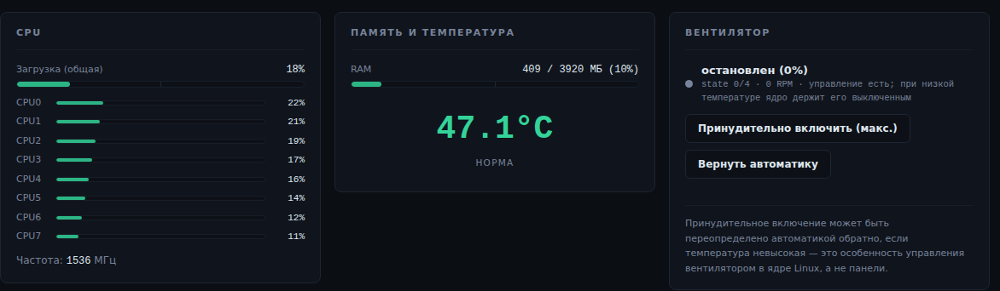 |

## `▌ PANEL // СКРИНШОТЫ`

| Управление | Режим с полётным контроллером |
|---|---|
|  |  |

| Failsafe | Видео |
|---|---|
|  |  |

| Система | ZeroTier |
|---|---|
| 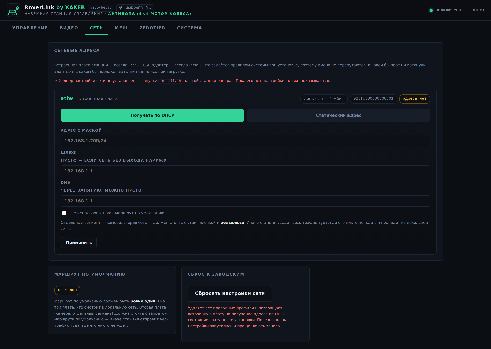 | 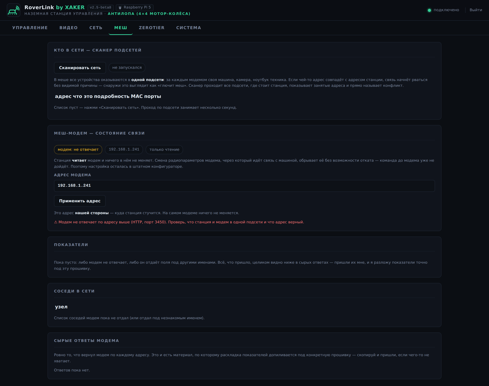 |
|---|---|

|  | 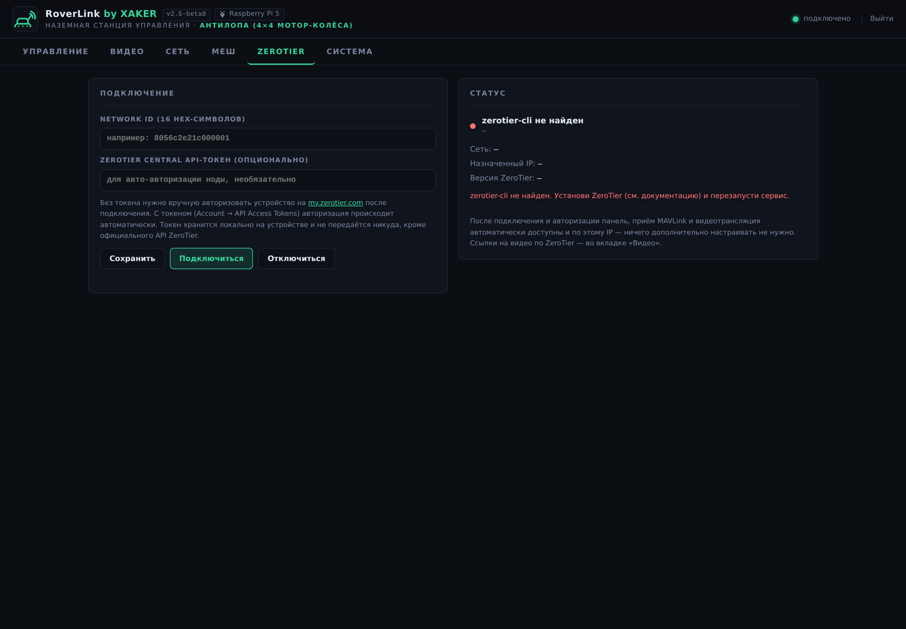 |

| Вход в панель | Активация |
|---|---|
|  | 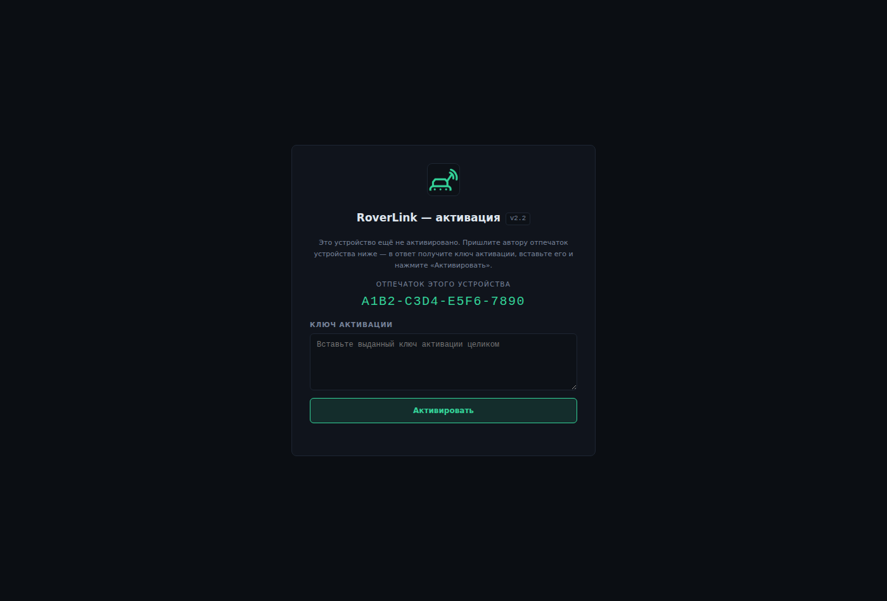 |

## `▌ VIDEO // ВИДЕОМАНУАЛ`

Два ролика с озвучкой. Интерфейс в кадре настоящий — те же файлы панели,
что стоят на устройстве; вымышлены только данные: адреса, отпечаток и
имена. Оба разбиты на главы с заставками, весь текст продублирован
подписями в кадре — можно смотреть и без звука.

| | |
|---|---|
| [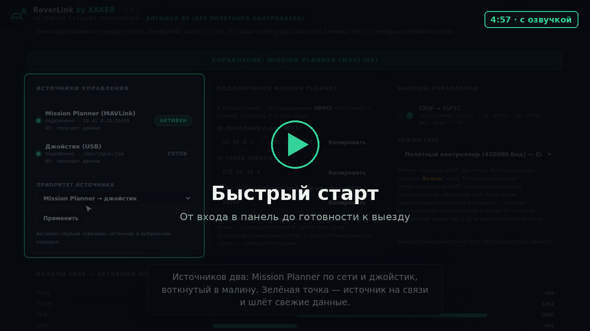](docs/video/roverlink-2.2-quickstart.mp4) | [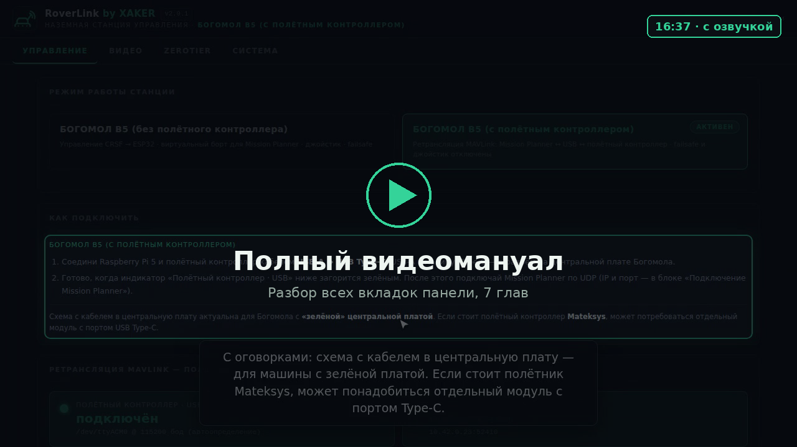](docs/video/roverlink-2.2-full-manual.mp4) |
| **[Быстрый старт](docs/video/roverlink-2.2-quickstart.mp4)** · 5:43 · 7 глав<br/>От входа в панель до готовности к выезду: режим станции, подключение железа со схемой распайки, источник управления и живые каналы, Mission Planner, выход CRSF, failsafe и смена пароля. Активации в этом ролике нет. | **[Полный видеомануал](docs/video/roverlink-2.2-full-manual.mp4)** · 19:49 · 8 глав<br/>Разбор панели целиком: что это за станция и на каком железе работает, активация, вход, вкладка «Управление» во всех деталях, failsafe, режим с полётным контроллером, видео, ZeroTier и система. |

Ролики лежат прямо в репозитории — по ссылке открывается плеер GitHub,
скачивать ничего не нужно. Рядом субтитры:
[quickstart.srt](docs/video/roverlink-2.2-quickstart.srt) ·
[full-manual.srt](docs/video/roverlink-2.2-full-manual.srt)


## `▌ HARDWARE // ЖЕЛЕЗО`

| Компонент | Назначение |
|---|---|
| Raspberry Pi 5 / Pi 4 или Radxa ROCK 5C | мозг станции; нужны 1–2 свободных UART на гребёнке |
| Внешняя WiFi-антенна (только ROCK 5C) | у Radxa антенны на плате нет, есть разъём u.FL |
| ESP32 на машине | приём CRSF по UART (3.3V, общий GND) |
| USB-плата захвата (UVC) | оцифровка аналогового FPV-видео |
| Опционально: второй FC с SBUS-входом | параллельный выход SBUS |

## `▌ ACCESS // ДОСТУП К ПРОЕКТУ`

RoverLink развивается по двухветочной модели (см.
[docs/licensing.md](docs/licensing.md)):

- **Свободное ядро (OSS, GPL-3.0)** — базовая версия станции, лицензия
  [LICENSE](LICENSE).
- **Коммерческая ветка** — расширенный функционал с активацией по ключам
  на каждое устройство, условия — [LICENSE-COMMERCIAL.md](LICENSE-COMMERCIAL.md).

Эта страница — витрина проекта: здесь документация, скриншоты и условия
лицензирования, исходный код в этом репозитории не публикуется. По вопросам
доступа, ключей активации и условий использования свяжитесь с автором.

## `▌ DOCS // ДОКУМЕНТАЦИЯ`

| Раздел | Описание |
|---|---|
| [docs/install.md](docs/install.md) | установка, UART, systemd |
| [docs/boards.md](docs/boards.md) | поддержанные платы: UART, пины, оверлеи, вентилятор, WiFi, кодеки |
| [docs/machines.md](docs/machines.md) | поддерживаемые НРТК: Богомол B5 и Антилопа |
| [docs/modes.md](docs/modes.md) | режимы станции: CRSF-борт, ретранслятор MAVLink по USB, «Антилопа» |
| [docs/robot-lora.md](docs/robot-lora.md) | разбор протокола «Антилопы»: кадр, CRC, маска, закон подмешивания |
| [docs/antelope-razbor-kratko.md](docs/antelope-razbor-kratko.md) | как этот протокол был разобран — коротко, по шагам |
| [docs/licensing.md](docs/licensing.md) | модель лицензирования: OSS-ядро + коммерческая ветка с активацией |
| [docs/mission-planner.md](docs/mission-planner.md) | подключение Mission Planner по сети |
| [docs/failsafe.md](docs/failsafe.md) | поведение при потере сигнала — прочти до первого выезда |
| [docs/video.md](docs/video.md) | видео: захват, RTSP, проброс без обработки, OSD, GStreamer |
| [docs/network.md](docs/network.md) | сетевые адреса из панели: DHCP/статика, имена плат, авто-откат |
| [docs/gamepad.md](docs/gamepad.md) | управление с геймпада: мёртвая рука, раскладка, пара по Bluetooth |
| [docs/ayaks-mesh.md](docs/ayaks-mesh.md) | меш AYAKS: состояние линка, сканер подсетей, конфликт адресов |
| [docs/zerotier.md](docs/zerotier.md) | удалённый доступ через ZeroTier |
| [docs/sbus.md](docs/sbus.md) | второй выход SBUS и режимы CRSF |
| [docs/wifi-ap.md](docs/wifi-ap.md) | WiFi-точка доступа, работа в поле |
| [docs/security.md](docs/security.md) | пароль панели, модель sudoers-хелперов |
| [docs/cloning.md](docs/cloning.md) | клонирование на несколько устройств |

## `▌ SAFETY // БЕЗОПАСНОСТЬ`

Это ПО управляет реальной машиной. Перед первым выездом:

1. Проверь **на земле** реакцию каждого канала на полный диапазон стика.
2. Настрой **failsafe** (вкладка Failsafe в панели) под логику своей машины
   и проверь его, физически оборвав связь.
3. **Смени пароль панели.** Вход защищён паролем всегда, но из коробки он
   стандартный — `roverlink`, и его знает каждый, кто читал этот файл.
   Меняется прямо из панели: «Система» → «Пароль веб-панели».

Автор не несёт ответственности за ущерб, причинённый использованием этого ПО
(см. разделы 15–16 лицензии GPL-3.0).

## `▌ LAYOUT // СТРУКТУРА ПРОЕКТА`

```
roverlink/
├── run.py                  # точка входа
├── VERSION                 # версия ПО — её показывает панель в шапке
├── config.example.yaml     # шаблон конфигурации (рабочий config.yaml — в .gitignore)
├── install.sh              # автоустановка: сам определяет плату и вендора
├── bridge/                 # ядро
│   ├── version.py           # чтение файла VERSION
│   ├── state.py             # общее состояние + арбитраж источников
│   ├── sources/             # источник управления: mavlink (Mission Planner)
│   ├── crsf/, sbus/, common/ # протоколы: упаковка кадров, CRC, 11-бит каналы
│   ├── failsafe/            # значения каналов + режим hold/mute
│   ├── video/               # ffmpeg → MediaMTX, автозапуск, заглушка
│   ├── zerotier/            # join/leave/статус/авто-авторизация
│   ├── system_monitor/      # CPU/RAM/температура/вентилятор
│   ├── wifi_ap/             # статус и смена SSID/пароля точки доступа
│   └── declone/             # «де-клонирование» SD-карты
├── webapp/                 # Flask + SocketIO, панель (static/css, static/js)
├── scripts/                # root-хелперы, деплой, дамп, смена пароля
├── systemd/                # unit-файл сервиса
└── data/                   # runtime-файлы (в .gitignore)
```

## `▌ CONTRIB // ВКЛАД В ПРОЕКТ`

Issues и pull request'ы приветствуются. Проект под GPL-3.0: отправляя PR, ты
соглашаешься лицензировать свой вклад на тех же условиях.

## `▌ LICENSE // ЛИЦЕНЗИЯ`

Свободное ядро — GPL-3.0, см. [LICENSE](LICENSE). Используя, модифицируя и
распространяя этот проект, ты соглашаешься сохранять производные работы
открытыми под той же лицензией.

Коммерческая ветка распространяется по отдельной проприетарной лицензии —
[LICENSE-COMMERCIAL.md](LICENSE-COMMERCIAL.md): активация по ключам, без
права копирования и передачи третьим лицам.

## `▌ COMMS // СВЯЗЬ`

По вопросам доступа к коммерческой ветке, ключей активации и условий
использования:

<div align="center">

[](https://t.me/dmitry_haker)
[](mailto:dmitry@hauger-it.com)
[](https://github.com/xaker-enginer)

</div>

<div align="center">
<sub><code>// end of transmission ●</code></sub>
</div>
